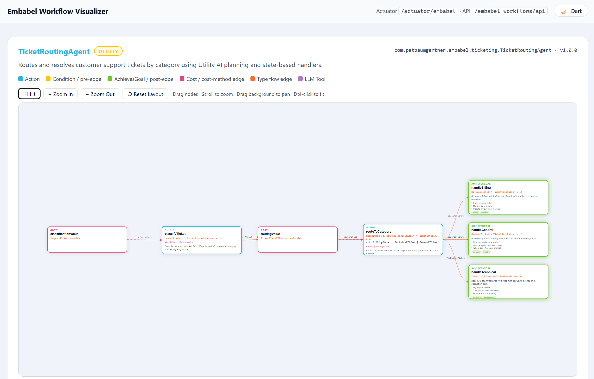

# Embabel Workflow Visualizer

[](https://github.com/patbaumgartner/embabel-workflow-visualizer/actions/workflows/ci.yml)
[](https://github.com/patbaumgartner/embabel-workflow-visualizer/actions/workflows/release.yml)
[](https://github.com/patbaumgartner/embabel-workflow-visualizer/actions/workflows/codeql.yml)
[](https://github.com/patbaumgartner/embabel-workflow-visualizer/actions/workflows/dependency-review.yml)
[](https://github.com/patbaumgartner/embabel-workflow-visualizer/actions/workflows/scorecards.yml)

A Spring Boot starter that adds a live workflow visualization UI and REST API for [Embabel](https://embabel.com) agents — zero code required.



---

## Project structure

This is a multi-module Maven project:

| Module | Purpose |
|---|---|
| `embabel-workflow-visualizer-starter` | Spring Boot auto-configuration, REST API, actuator endpoint, and visualization UI |
| `embabel-sample-application` | Runnable sample Embabel application that uses the starter |

## Build and test

```bash
# Build and test everything from the repository root
mvn test

# Test only the starter module
mvn -pl embabel-workflow-visualizer-starter test
```

## Usage

Compatibility note: this project is validated against [Embabel](https://github.com/embabel/embabel-agent) 0.4.0 (the latest release, available on Maven Central) and supports all Embabel annotation features: `@Agent` (GOAP / UTILITY / SUPERVISOR planners, `opaque`), `@EmbabelComponent`, `@Action` (`pre`/`post`, `cost`/`value`, `costMethod`/`valueMethod`, `canRerun`, `readOnly`, `clearBlackboard`, `outputBinding`), `@Condition`, `@Cost`, `@AchievesGoal` (`value`, `tags`, `examples`, `@Export` MCP publishing), `@State`, and `@LlmTool`.

### 1. Add the dependency

The library is published to [Maven Central](https://central.sonatype.com/artifact/com.patbaumgartner.embabel/embabel-workflow-visualizer-starter).

```xml
<dependency>
    <groupId>com.patbaumgartner.embabel</groupId>
    <artifactId>embabel-workflow-visualizer-starter</artifactId>
    <version>0.1.1</version>
</dependency>
```

Embabel 0.4.0 and the visualizer starter are both published to Maven Central, so no extra repository configuration is needed. Only if your project uses Embabel *snapshot* dependencies, add the Embabel snapshot repository:

```xml
<repositories>
  <!-- Required for com.embabel.agent.* snapshot dependencies -->
  <repository>
    <id>embabel-snapshots</id>
    <name>Embabel Snapshot Repository</name>
    <url>https://repo.embabel.com/artifactory/libs-snapshot</url>
    <releases><enabled>false</enabled></releases>
    <snapshots><enabled>true</enabled></snapshots>
  </repository>
</repositories>
```

### 2. Configure your `application.properties`

```properties
# Expose the actuator endpoint over HTTP
management.endpoints.web.exposure.include=health,info,embabel

# Enable the REST API (GET /embabel-workflows/api) and the visualization UI
embabel.workflow.visualizer.enabled=true
```

## Endpoints

| Endpoint | Requires | Description |
|---|---|---|
| `GET /actuator/embabel` | `management.endpoints.web.exposure.include=embabel` | Returns the workflow catalog as JSON |
| `GET /embabel-workflows/api` | `embabel.workflow.visualizer.enabled=true` | REST API — returns the workflow catalog as JSON |
| `GET /embabel-workflows` | `embabel.workflow.visualizer.enabled=true` | Interactive pan/zoom workflow visualization UI |

## Auto-configuration

The starter activates automatically when:

- The application runs in a **servlet web environment** (`@ConditionalOnWebApplication(SERVLET)`)
- **Spring Boot Actuator** is on the classpath

| Bean | Always registered | Condition |
|---|---|---|
| `EmbabelWorkflowCatalogService` | ✅ | Discovers `@Agent` beans via the `ApplicationContext` |
| `EmbabelWorkflowActuatorEndpoint` | When exposed | Requires `management.endpoints.web.exposure.include=embabel` |
| `EmbabelWorkflowApiController` | Off by default | Requires `embabel.workflow.visualizer.enabled=true` |
| `WorkflowVisualizerPageController` | Off by default | Requires `embabel.workflow.visualizer.enabled=true` |

All beans use `@ConditionalOnMissingBean` — declare your own bean to replace any of them.

## Visualization UI

The UI (`GET /embabel-workflows`) renders each discovered `@Agent` as an interactive flow diagram:

- **Drag individual nodes** to rearrange the layout · **Drag the background** to pan · **Scroll** to zoom · **Double-click** background to auto-fit
- Hover over any node to spotlight its connected edges and neighbours
- Per-agent controls: Fit, Zoom In, Zoom Out, Reset Layout
- Node types color-coded with the 42talents brand palette (cyan, yellow, green, pink, orange)
- Animated flowing arrows on pre-condition edges; AchievesGoal nodes glow green
- Node badges surface `canRerun`, `readOnly`, `clearBlackboard`, `@LlmTool`, and MCP-exported goals (`@Export(remote = true)`)
- Cost / value rows show static `cost=` / `value=` declarations, dynamic `costMethod=` / `valueMethod=` references, and `@AchievesGoal(value=)`
- Light / dark mode toggle, respects `prefers-color-scheme`

## Sample agents

The `embabel-sample-application` module ships ten demo agents covering common enterprise use cases.
Each agent intentionally demonstrates a **different workflow pattern** so you can see how the Embabel
planner handles linear flows, fan-in, branching, converging branches, dynamic cost methods, static
cost declarations, Utility AI planning, @State routing, LLM-supervised planning, and revision loops.

| Agent | Workflow pattern | Description | Endpoint |
|---|---|---|---|
| `KycVerificationAgent` | Branching + 2× `@AchievesGoal` | Screens a customer against risk indicators; routes to enhanced due diligence or a direct risk assessment. | `POST /api/kyc/verify` |
| `FraudDetectionAgent` | Linear pipeline, `readOnly` enrichment | Pure three-step pipeline: data enrichment (no LLM), pattern screening, final decision. Single `@AchievesGoal`. | `POST /api/fraud/detect` |
| `SentimentAnalysisAgent` | `@Cost` method + `costMethod=` | Dynamic cost calculations drive planner decisions; static `cost=` on the cheap first step. Single `@AchievesGoal`. | `POST /api/sentiment/analyze` |
| `ResumeScreeningAgent` | Fan-in (no conditions) | Two independent analyses (`analyzeResume`, `assessCultureFit`) both start from the same input and converge into a single `@AchievesGoal`. | `POST /api/recruitment/screen` |
| `ContentModerationAgent` | Converging branches → single `@AchievesGoal` | Two condition-gated branches both produce `TaggedContent`; the terminal action operates on that type regardless of which branch ran. | `POST /api/moderation/evaluate` |
| `LoanApplicationAgent` | Branching + static `cost=` on every action | Two `@Condition`s split the flow; every `@Action` declares a static `cost=` so the planner can weigh paths. Two `@AchievesGoal` actions. | `POST /api/loan/apply` |
| `DocumentProcessingAgent` | Default-producer for optional input + full `@AchievesGoal` | `provideDefaultMetadataHints` supplies `MetadataHints` only when the caller did not; `Ai` injection, static `value=`, `canRerun`, and `@Export(remote = true)` MCP goal publishing. | `POST /api/documents/process` |
| `TicketRoutingAgent` | `UTILITY` planner + `@State` routing | Utility AI planner ranks actions by dynamic `valueMethod=`; `routeToCategory` returns one of three `@State` records, each containing its own `@AchievesGoal` handler. | `POST /api/tickets/route` |
| `ProductResearchAgent` | `SUPERVISOR` planner + SpEL precondition + `@EmbabelComponent` | LLM-supervised planning; `pre = {"spel:marketData.confidenceScore > 0.6"}` gates the competitor analysis; `ResearchUtils` contributes `gatherMarketData` (with `outputBinding`) as a shared `@EmbabelComponent`. | `POST /api/research/analyze` |
| `StoryWriterAgent` | Revision loop (`canRerun`) + `@LlmTool` + persona | Draft → review → revise loop until editorial approval; `PersonaSpec` prompt contributor, per-action `LlmOptions` temperatures, `ActionException.Transient`/`Permanent`, and an `@LlmTool` method. | `POST /api/story/write` |

Ready-to-run HTTP request examples for all ten agents are in [`embabel-sample-application/requests/`](embabel-sample-application/requests/).
