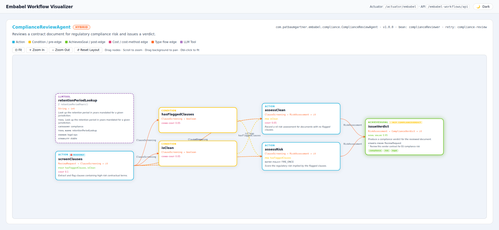
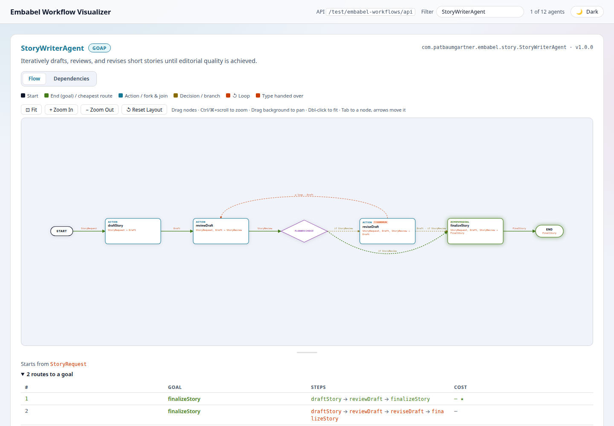

# Embabel Workflow Visualizer

[](https://github.com/patbaumgartner/embabel-workflow-visualizer/actions/workflows/ci.yml)
[](https://github.com/patbaumgartner/embabel-workflow-visualizer/actions/workflows/release.yml)
[](https://github.com/patbaumgartner/embabel-workflow-visualizer/actions/workflows/codeql.yml)
[](https://github.com/patbaumgartner/embabel-workflow-visualizer/actions/workflows/dependency-review.yml)
[](https://github.com/patbaumgartner/embabel-workflow-visualizer/actions/workflows/scorecards.yml)

A Spring Boot starter that adds a live workflow visualization UI and REST API for [Embabel](https://embabel.com) agents — zero code required.



---

## Project structure

This is a multi-module Maven project:

| Module | Purpose |
|---|---|
| `embabel-workflow-visualizer-starter` | Spring Boot auto-configuration, REST API, actuator endpoint, and visualization UI |
| `embabel-sample-application` | Runnable sample Embabel application that uses the starter |

## Build and test

Java 21+ is the only prerequisite — the Maven wrapper supplies Maven.

```bash
# Build, test, format-check and coverage-check everything
OPENAI_API_KEY=dummy ./mvnw verify

# The published artifact only (no API key needed)
./mvnw verify -pl embabel-workflow-visualizer-starter
```

The sample application needs `OPENAI_API_KEY` present to start its context; no
test calls a model, so a placeholder is enough. See
[CONTRIBUTING.md](CONTRIBUTING.md) to run the visualizer locally.

## Usage

Compatibility note: this project is built against [Spring Boot](https://spring.io/projects/spring-boot) 4.1 and validated against [Embabel](https://github.com/embabel/embabel-agent) 1.5.1 (the latest release, available on Maven Central). Embabel 1.5 requires Spring Boot 4.x / Spring AI 2.x, so this line of the starter is **Spring Boot 4 only**.

| Visualizer | Spring Boot | Embabel | Java |
|---|---|---|---|
| `1.1.x` | 4.1.x | 1.5.x | 21+ |
| `1.0.x` | 4.1.x | 1.5.x | 21+ |
| `0.3.x` | 3.5.x | 1.0.x | 21+ |

A single artifact cannot support both Spring Boot 3 and 4 (Spring Framework 7 baseline), so consumers still on Spring Boot 3.5 should stay on the `0.3.x` line.

### Upgrading from 1.0.x

The visualizer page is now served by its controller instead of as a static
resource, which is what lets it work under a context path and keeps it
unreachable while the visualizer is disabled. Consequently the undocumented
`/workflow-visualizer.html` URL is gone — use `/embabel-workflows` (or your
configured `base-path`), which is unchanged and has always been the documented
entry point.

It supports every Embabel annotation feature: `@Agent` (GOAP / UTILITY / HYBRID / SUPERVISOR planners, `opaque`, `provider`, `beanName`, `scan`, agent-level `actionRetryPolicy` / `actionRetryPolicyExpression`), `@EmbabelComponent` (`scan`), `@Action` (`pre`/`post`, `cost`/`value`, `costMethod`/`valueMethod`, `canRerun`, `readOnly`, `clearBlackboard`, `outputBinding`, event `trigger`, `actionRetryPolicy` and `actionRetryPolicyExpression`), `@Condition` (`name`, `cost`), `@Cost`, `@AchievesGoal` (`value`, `tags`, `examples`, and `@Export` with `remote`, `local`, `name`, `startingInputTypes`), `@State`, `@LlmTool` (`description`, `name`, `returnDirect`, `category`, `metadata`), and the `@Provided` / `@RequireNameMatch` parameter annotations.

### 1. Add the dependency

The library is published to [Maven Central](https://central.sonatype.com/artifact/com.patbaumgartner.embabel/embabel-workflow-visualizer-starter).

```xml
<dependency>
    <groupId>com.patbaumgartner.embabel</groupId>
    <artifactId>embabel-workflow-visualizer-starter</artifactId>
    <version>1.1.0</version>
</dependency>
```

`1.1.0` is the current release; check
[Maven Central](https://central.sonatype.com/artifact/com.patbaumgartner.embabel/embabel-workflow-visualizer-starter)
for the latest version. The *Since* column in the configuration table below
says which release introduced each property.

Embabel 1.5.1 and the visualizer starter are both published to Maven Central, so no extra repository configuration is needed. Only if your project uses Embabel *snapshot* dependencies, add the Embabel snapshot repository:

```xml
<repositories>
  <!-- Required for com.embabel.agent.* snapshot dependencies -->
  <repository>
    <id>embabel-snapshots</id>
    <name>Embabel Snapshot Repository</name>
    <url>https://repo.embabel.com/artifactory/libs-snapshot</url>
    <releases><enabled>false</enabled></releases>
    <snapshots><enabled>true</enabled></snapshots>
  </repository>
</repositories>
```

### 2. Configure your `application.properties`

```properties
# Expose the actuator endpoint over HTTP
management.endpoints.web.exposure.include=health,info,embabel

# Enable the REST API (GET /embabel-workflows/api) and the visualization UI
embabel.workflow.visualizer.enabled=true
```

### Configuration

| Property | Default | Since | Description |
|---|---|---|---|
| `embabel.workflow.visualizer.enabled` | `false` | 0.1 | Serves the UI and its REST API |
| `embabel.workflow.visualizer.base-path` | `/embabel-workflows` | 1.1 | Path the UI is mounted on; the REST API is served from `<base-path>/api` |

Both properties ship IDE completion and documentation via
`spring-configuration-metadata.json`. A `base-path` that would produce a broken
mapping (no leading slash, or a trailing one) fails at startup rather than
404-ing at request time.

## Endpoints

| Endpoint | Requires | Description |
|---|---|---|
| `GET /actuator/embabel` | `management.endpoints.web.exposure.include=embabel` | Returns the workflow catalog as JSON |
| `GET <base-path>/api` | `embabel.workflow.visualizer.enabled=true` | REST API — returns the workflow catalog as JSON |
| `GET <base-path>` | `embabel.workflow.visualizer.enabled=true` | Interactive pan/zoom workflow visualization UI |

All three work unchanged behind a `server.servlet.context-path` or a
reverse-proxy prefix: the UI resolves its API URL from the browser's own
location rather than assuming it is mounted at the root.

> **Security** — these endpoints describe your application's internals (agent
> class names, method names, goal descriptions). They are off by default and add
> no authentication of their own. See [SECURITY.md](SECURITY.md) for the threat
> model and an example Spring Security configuration.

## Auto-configuration

The starter activates automatically when:

- The application runs in a **servlet web environment** (`@ConditionalOnWebApplication(SERVLET)`)
- **Spring Boot Actuator** is on the classpath

| Bean | Always registered | Condition |
|---|---|---|
| `EmbabelWorkflowCatalogService` | ✅ | Discovers `@Agent` beans via the `ApplicationContext` |
| `EmbabelWorkflowActuatorEndpoint` | When exposed | Requires `management.endpoints.web.exposure.include=embabel` |
| `EmbabelWorkflowApiController` | Off by default | Requires `embabel.workflow.visualizer.enabled=true` |
| `WorkflowVisualizerPageController` | Off by default | Requires `embabel.workflow.visualizer.enabled=true` |

All beans use `@ConditionalOnMissingBean` — declare your own bean to replace any of them.

Discovery inspects bean **types**, never bean instances, so reading the catalog
never initialises a lazy singleton or a `FactoryBean` product in your
application. The result is scanned once and reused, and re-scanned only when the
application reaches a startup milestone that can have changed it — the context
refreshing, and the application becoming ready. The server accepts requests
before both, so an early caller gets an honest answer from a half-built
application rather than a repeated full scan on every request.

## Declared vs. running

Annotations say what an author *declared*; the planner decides what actually
*runs*, and the two genuinely differ. When a live Embabel `AgentPlatform` is
present the catalog is reconciled against it, so the UI shows both views at once:

| Signal | Meaning |
|---|---|
| **⚙ planner** | The step exists only at runtime — the planner synthesised it and no annotation declares it |
| **⚠ not in plan** (dashed outline) | The step is declared, but the planner does not run it |
| **not deployed** (agent badge) | The class is annotated, but the platform never registered the agent |
| `RUNTIME` planner badge | The agent was assembled in code and has no annotated class at all |

The sample application shows why this matters. `ProductResearchAgent` uses the
`SUPERVISOR` planner, so its declared `analyzeCompetitors` action is **not** a
planner action — Embabel replaces the declared actions with a single synthetic
`supervisor` action that orchestrates them as tools. Nothing in the source says
so. Likewise `TicketRoutingAgent` gains a synthetic `Nirvana` goal from the
`UTILITY` planner.

Steps that are legitimately not plan steps — `@Cost` functions and `@LlmTool`
methods — are never flagged, so the signal stays worth reading.

Without an agent platform on the classpath nothing changes: `registered` is
`null` throughout, meaning "not known" rather than "not registered", and the
catalog is exactly the declared view. The platform is read reflectively and only
when it has already been created, so this adds no compile-time dependency and
still initialises nothing.

The starter deliberately never imports Embabel types — annotations are read
reflectively by name. `embabel-agent-api` is a test-scoped dependency, so you
can upgrade Embabel without waiting for a visualizer release, and an attribute
your Embabel version does not declare simply reads as "not set".

## Flow chart

The dependency graph shows what each step *needs*; the **Flow** tab shows what
can *happen*: every route from Start to a goal, in execution order.



The chart is derived from the same annotations, with no model call and nothing
executed. Embabel's planner treats a goal as reached once the goal action's
output type is on the blackboard, and an action as runnable once its inputs are
there and its preconditions hold — so the visualizer chains backwards from each
`@AchievesGoal`, through the actions that produce each input and post each
condition, down to the **entry types**: the inputs no action produces
(`@Export(startingInputTypes=)` overrides them). Each distinct chain is a route.

| Shape | Meaning |
|---|---|
| **Start** / **End** | The entry types, and one End per goal action, labelled with the goal type |
| **Card** | An action, with its inputs → output, cost and badges; hover for the full details |
| **Diamond** | A branch: `@Condition`s become `if …` edge labels, a `spel:` precondition shows its expression, a `@State` return type fans out one edge per state, and two actions that could both run next are a *planner choice* |
| **Fork / join bars** | Independent steps that all run, in whatever order the planner picks |
| **↺ dashed arc** | A loop — a `canRerun` action feeding a type back to an earlier consumer |
| **Dashed strip** | Steps outside every route: declared but not in the plan (see above), or in the plan but unable to reach a goal |

Edges carry the blackboard type handed over. The table under the chart lists the
routes with their summed static `cost=`; the cheapest one is drawn bold and
starred, with a *+ dynamic* note when a `costMethod=` adds a run-time amount.
Hovering a row lights up that route in the chart. Which route actually runs,
and the order of independent steps, is the planner's call at run time.

Inputs marked `Optional<T>` or `@Nullable` are skipped when chaining, so a
step that merely *prefers* an input does not drag its producer into the route.
Only annotations retained at run time count — that is what Embabel itself
binds against — so JSpecify, Jakarta and Spring `@Nullable` work, while
JetBrains' (class retention) is invisible to both.

In the JSON, each agent gains a `flow` object (`entryTypes`, `nodes`, `edges`,
`paths`, `truncated`) and each step an `optionalInputs` list. Routes are capped
at 100 per agent; `truncated` says when the cap was hit.

## Visualization UI

The UI (`GET /embabel-workflows`) renders each discovered `@Agent` as an interactive flow diagram, with a **Flow** tab (routes to each goal, see [Flow chart](#flow-chart)) and a **Dependencies** tab (every declared step and what it needs); the choice is remembered:

- **Drag individual nodes** to rearrange the layout · **Drag the background** to pan · **Ctrl/⌘ + scroll** to zoom · **Double-click** background to auto-fit
- Hover over any node to spotlight its connected edges and neighbours; hover a route in the Flow tab's table to light it up in the chart
- Per-agent controls: Fit, Zoom In, Zoom Out, Reset Layout; tabs, nodes and routes are keyboard-operable
- Node types color-coded with the 42talents brand palette (cyan, yellow, green, pink, orange)
- Animated flowing arrows on pre-condition edges; AchievesGoal nodes glow green
- Node badges surface `canRerun`, `readOnly`, `clearBlackboard`, `@LlmTool`, event-triggered actions (`@Action(trigger=)`), `returnDirect` tools, MCP-exported goals (`@Export(remote = true)`), and goals withheld from local callers (`@Export(local = false)`)
- Runtime provenance: planner-synthesised steps, and declared steps the planner does not run (see [Declared vs. running](#declared-vs-running))
- Cost / value rows show static `cost=` / `value=` declarations, dynamic `costMethod=` / `valueMethod=` references, `@AchievesGoal(value=)`, and `@Condition(cost=)`; `retry` / `retry policy` rows show the per-action SpEL QoS key and `ActionRetryPolicy` constant, and `category`, `tool name` and metadata rows describe the `@LlmTool`
- Goal rows show `starts from` for `@Export(startingInputTypes=)`; step rows show `provided` (`@Provided`) and `name match` (`@RequireNameMatch`) parameters
- Agent headers show the planner badge (GOAP / UTILITY / HYBRID / SUPERVISOR / COMPONENT), `opaque`, a `scan off` badge for `scan = false`, and the `beanName` plus agent-level retry policy
- Filter agents by name, class, planner, provider or bean name, with a live count
- Light / dark mode toggle, respects `prefers-color-scheme`; honours `prefers-reduced-motion`
- Self-contained single page: no third-party scripts, fonts or styles, and exactly one request — to its own API

## Sample agents

The `embabel-sample-application` module ships eleven demo agents covering common enterprise use cases.
Each agent intentionally demonstrates a **different workflow pattern** so you can see how the Embabel
planner handles linear flows, fan-in, branching, converging branches, dynamic cost methods, static
cost declarations, Utility AI planning, Hybrid planning, @State routing, LLM-supervised planning, and
revision loops.

| Agent | Workflow pattern | Description | Endpoint |
|---|---|---|---|
| `KycVerificationAgent` | Branching + 2× `@AchievesGoal` | Screens a customer against risk indicators; routes to enhanced due diligence or a direct risk assessment. | `POST /api/kyc/verify` |
| `FraudDetectionAgent` | Linear pipeline, `readOnly` enrichment | Pure three-step pipeline: data enrichment (no LLM), pattern screening, final decision. Single `@AchievesGoal`. | `POST /api/fraud/detect` |
| `SentimentAnalysisAgent` | `@Cost` method + `costMethod=` | Dynamic cost calculations drive planner decisions; static `cost=` on the cheap first step. Single `@AchievesGoal`. | `POST /api/sentiment/analyze` |
| `ResumeScreeningAgent` | Fan-in (no conditions) | Two independent analyses (`analyzeResume`, `assessCultureFit`) both start from the same input and converge into a single `@AchievesGoal`. | `POST /api/recruitment/screen` |
| `ContentModerationAgent` | Converging branches → single `@AchievesGoal` | Two condition-gated branches both produce `TaggedContent`; the terminal action operates on that type regardless of which branch ran. | `POST /api/moderation/evaluate` |
| `LoanApplicationAgent` | Branching + static `cost=` on every action | Two `@Condition`s split the flow; every `@Action` declares a static `cost=` so the planner can weigh paths. Two `@AchievesGoal` actions. | `POST /api/loan/apply` |
| `DocumentProcessingAgent` | Default-producer for optional input + full `@AchievesGoal` | `provideDefaultMetadataHints` supplies `MetadataHints` only when the caller did not; `Ai` injection, static `value=`, `canRerun`, and `@Export(remote = true)` MCP goal publishing. | `POST /api/documents/process` |
| `TicketRoutingAgent` | `UTILITY` planner + `@State` routing | Utility AI planner ranks actions by dynamic `valueMethod=`; `routeToCategory` returns one of three `@State` records, each containing its own `@AchievesGoal` handler. | `POST /api/tickets/route` |
| `ProductResearchAgent` | `SUPERVISOR` planner + SpEL precondition + `@EmbabelComponent` | LLM-supervised planning; `pre = {"spel:marketData.confidenceScore > 0.6"}` gates the competitor analysis; `ResearchUtils` contributes `gatherMarketData` (with `outputBinding`) as a shared `@EmbabelComponent`. | `POST /api/research/analyze` |
| `StoryWriterAgent` | Revision loop (`canRerun`) + `@LlmTool` + persona | Draft → review → revise loop until editorial approval; `PersonaSpec` prompt contributor, per-action `LlmOptions` temperatures, `ActionException.Transient`/`Permanent`, and an `@LlmTool` method. | `POST /api/story/write` |
| `ComplianceReviewAgent` | `HYBRID` planner + retry policies + restricted export | Pure-Java branching review; agent-level `beanName` and `actionRetryPolicyExpression` (a QoS key under `embabel.agent.platform.action-qos.*`), `@Action(actionRetryPolicy = FIRE_ONCE)`, `@Condition(cost=)`, `@Export(startingInputTypes=)`, and an `@LlmTool` with `name` and `metadata`. | `POST /api/compliance/review` |

Ready-to-run HTTP request examples for all eleven agents are in [`embabel-sample-application/requests/`](embabel-sample-application/requests/).

## Contributing

Bug reports and pull requests are welcome — see [CONTRIBUTING.md](CONTRIBUTING.md)
for the build, the design constraints, and what a good pull request looks like.

## License

Apache License 2.0 — see [LICENSE](LICENSE).
